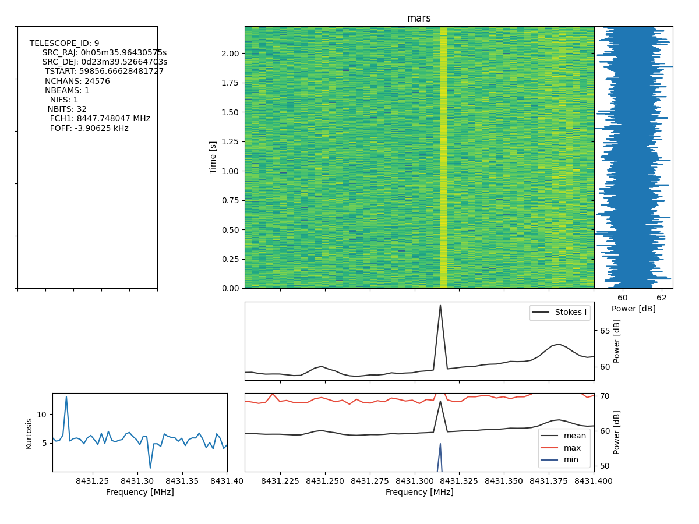
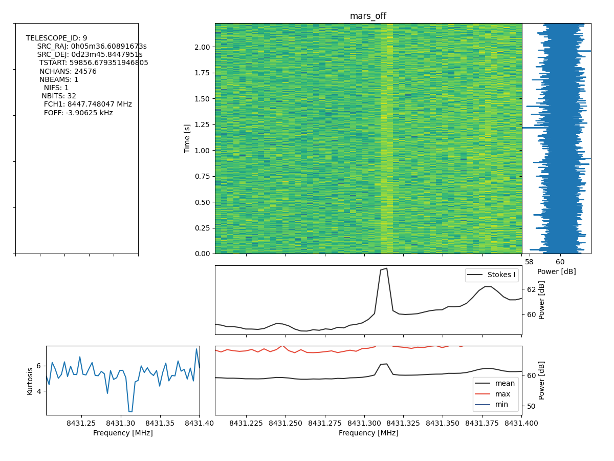

# Compilation

- Get meson, specifically: `pip install meson==0.61.3`.
  This avoids an issue in compiling capnprot for seticore, that occurs with v0.64.0.

- Get BLADE: `git clone https://github.com/MydonSolutions/blade.git && cd blade && git checkout blade-cli-vla`

- Pull all submodules (recursively): `git submodule update --recursive --init`

- Setup the build folder: `CXX=g++-10 meson build -Dseticore:werror=false && cd build`

- Compile: `ninja`

# Primary Sky-Data Test

The ATA recorded a pair of RAW stems, one with phase center on Mars and another offset from Mars (+0.1 hours in Right-Ascension, and +0.001 degrees in Declination). The beamforming of these is qualitatively indicative of effective beamforming.

- Retrieve the data
  ```
  rsync -avW rsync://blpd18.ssl.berkeley.edu/datax/guppi_59856_57567_103605834_mars_0001.bfr5 .
  rsync -avW rsync://blpd18.ssl.berkeley.edu/datax/guppi_59856_57567_103605834_mars_0001.0000.raw .
  ```

  ```
  rsync -avW rsync://blpd18.ssl.berkeley.edu/datax/guppi_59856_58696_103674743_mars_off_0001.0000.raw .
  rsync -avW rsync://blpd18.ssl.berkeley.edu/datax/guppi_59856_58696_103674743_mars_off_0001.bfr5 .
  ```

  - These BFR5 files were produced by `bfr5_gen.jl` from this [repo](https://github.com/MydonSolutions/ata_bfr5_genie).

- Then beamform based on a RAW-BFR5 input pair:

  `./build/apps/blade-cli/blade-cli --input-type CI8 --output-type F32 -t ATA -m B -c 128 -T 32 -C 1 -N 1 ./guppi_59856_58696_103674743_mars_off_0001.0000.raw ./guppi_59856_58696_103674743_mars_off_0001.bfr5 ./guppi_59856_58696_103674743_mars_off_output`

- `watutil -p ank -b 8431.2 -e 8431.4` was used to produce the following plots of the output filterbank files.

  

  

# Synthesized BLADE-cli test inputs

Refer to the [fundamental tests](./tests_fundamental/tests.md).

# Python Beamforming for Comparison

Beamform in Python (the output is in the same directory of the raw file and suffixed with -beam{:04d}.0000.raw):

`./tests/apps/blade-cli/beamform.py synthetic_test_rand.bfr5 synthetic_test_rand.0000.raw -u 1`

Compare in Julia:

`./tests/apps/blade-cli/compare_raw.jl synthetic_test_rand_bladeout.0000.raw synthetic_test_rand-beam000.0000.raw `
