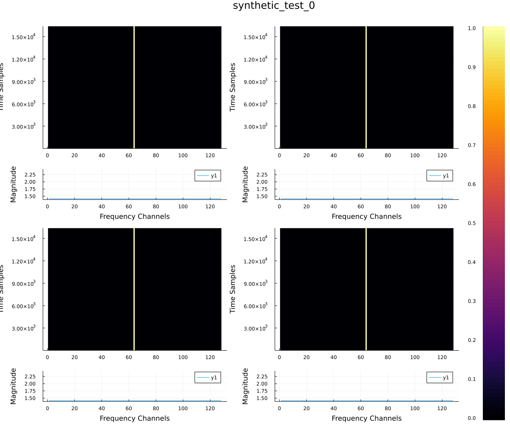
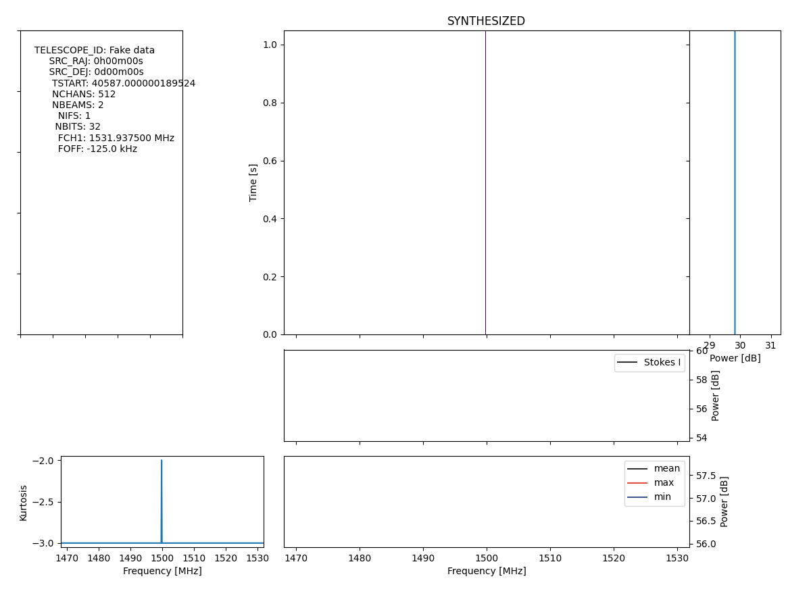
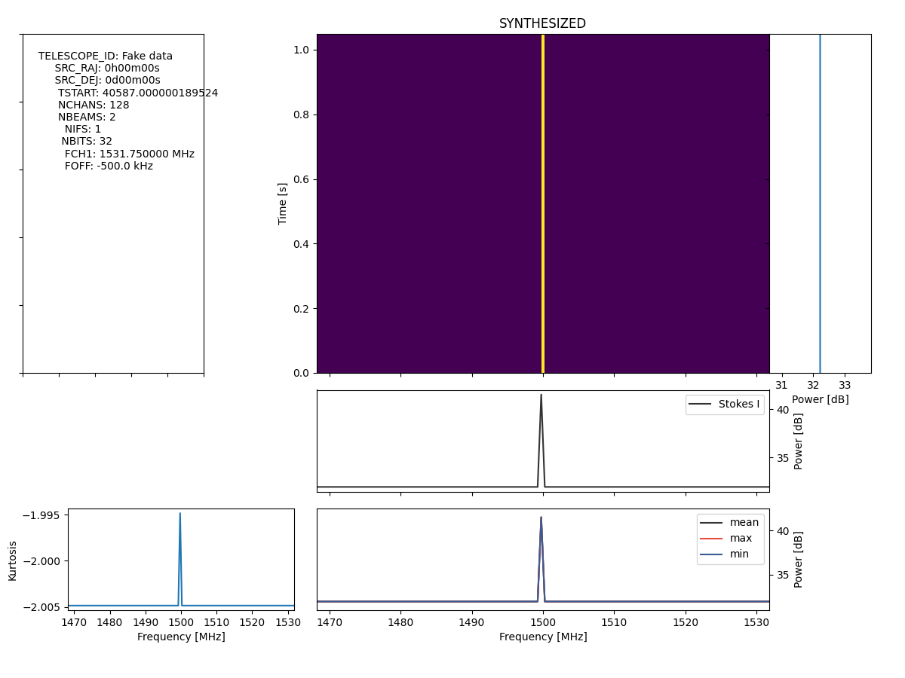
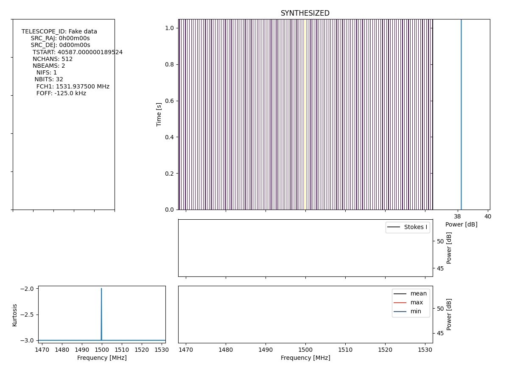
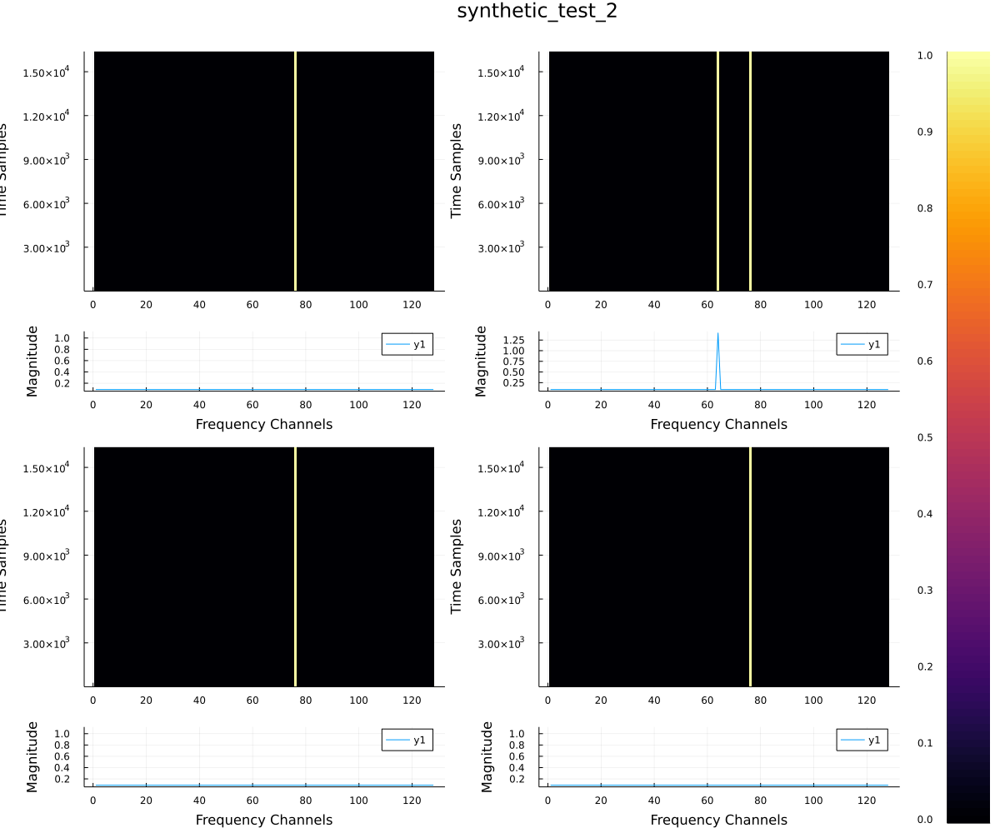
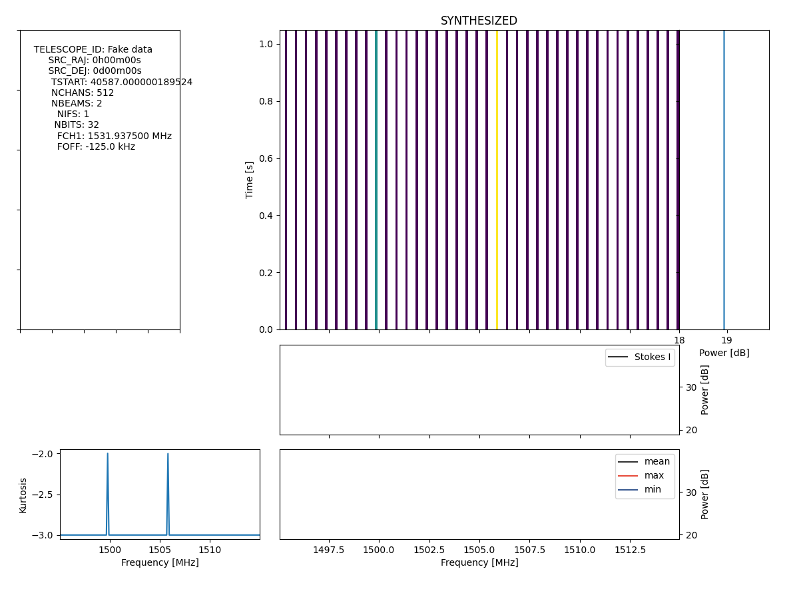
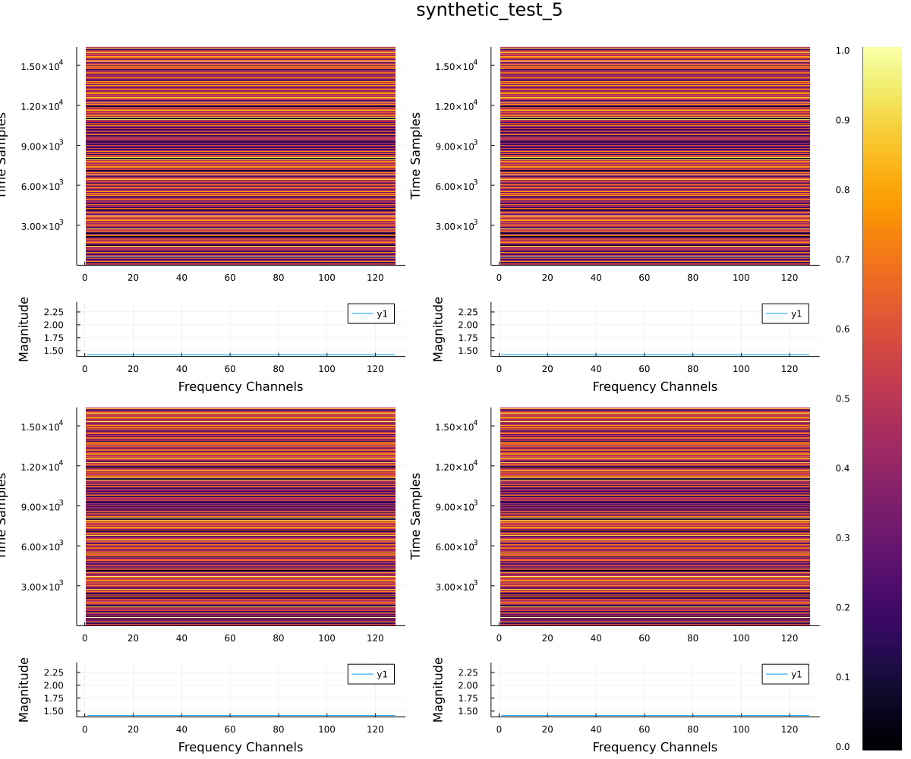
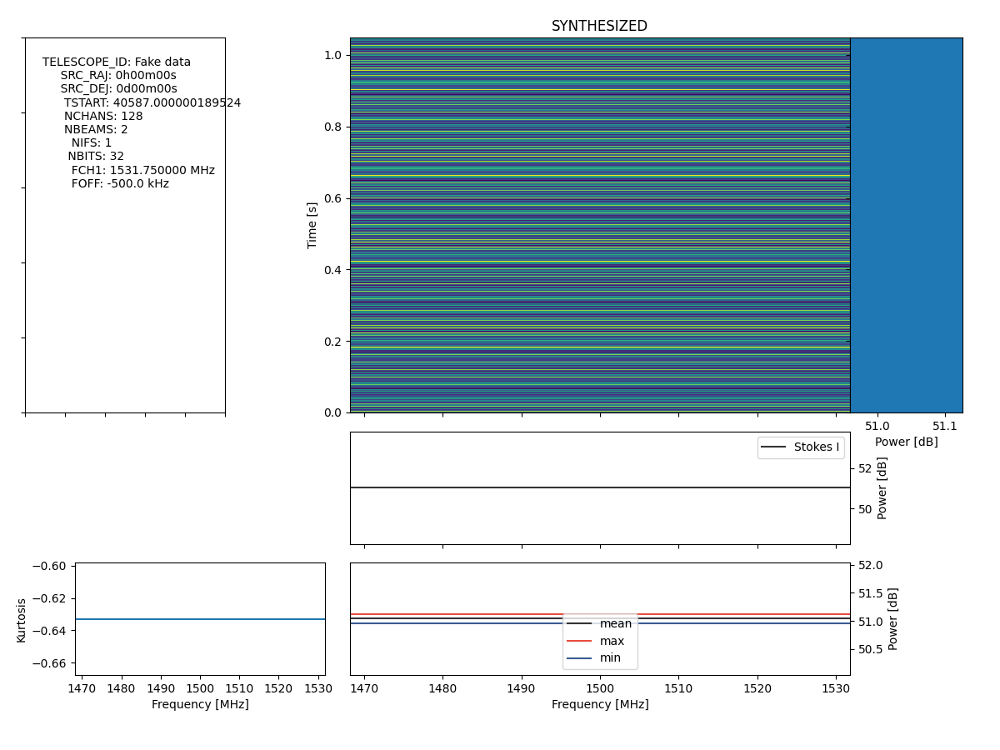

# Fundamental Beamforming Tests

## Julia Package Installation

```
julia 
	> ]
	Pkg > add https://github.com/david-macmahon/BeamformerRecipes.jl
	Pkg > add https://github.com/david-macmahon/Blio.jl
	Pkg > add Plots
	Pkg > *backspace*
	> *Ctrl+d*
```

## Tests

For the purposes of brevity, the RAW data is spoken about programmatically, with dimensions [fastest=pol, time, chan, slowets=ant], as are the antenna coefficients, with dimensions [fastest=ant, pol, slowest=chan].

The synthesized tests have the following RAW block dimension, unless otherwise stated: [A: 4, F: 128, T: 16384, P: 2, 8bit-complex].

One coherent and one incoherent beam are formed, unless otherwise stated;

The BLADE-CLI is run with `-C 64` to ensure that the coarse frequency-channel stepping works, and with `-T 4096`, unless otherwise stated.

`./build/apps/blade-cli/blade-cli -t VLA -m B --input-type CI8 --output-type F32 -c 32 -C 64 -T 4096 -N 1 /mnt/buf1/mydonsol_blade/basics/synthetic_test_0 /mnt/buf1/mydonsol_blade/basics/synthetic_test_0.bfr5 /mnt/buf1/mydonsol_blade/basics/synthetic_test_0_output`

Each test is collapsed below.

<details><summary>0. cal_all Ones, delays Zeros, RAW signal in [:, :, NCHAN/2, :]</summary>


<details><summary>GUPPI RAW Input</summary>



</details>

<details><summary>Beamformed Output (No upchannelization)</summary>


</details>

<details><summary>Beamformed Output (upchannelization rate of 4)</summary>



</details>


</details>


<details><summary>1. cal_all Ones, delays Zeros, RAW signal in [:, :, NCHAN/2, NANT/2]</summary>


<details><summary>GUPPI RAW Input</summary>


</details>

<details><summary>Beamformed Output (No upchannelization)</summary>


</details>

<details><summary>Beamformed Output (upchannelization rate of 4)</summary>


</details>


</details>


<details><summary>2. delays Zeros, cal_all band pass in [:, :, NCHAN/2], RAW signal in [:, :, NCHAN/2, NANT/2] and [:, :, 3*NCHAN/2, :]</summary>


<details><summary>GUPPI RAW Input</summary>



</details>

<details><summary>Beamformed Output (No upchannelization)</summary>


</details>

<details><summary>Beamformed Output (upchannelization rate of 4)</summary>



</details>


</details>


<details><summary>5. delays Zeros, cal_all Ones, RAW complex Exponential data</summary>


<details><summary>GUPPI RAW Input</summary>



</details>

<details><summary>Beamformed Output (No upchannelization)</summary>


</details>

<details><summary>Beamformed Output (upchannelization rate of 4)</summary>


</details>


</details>