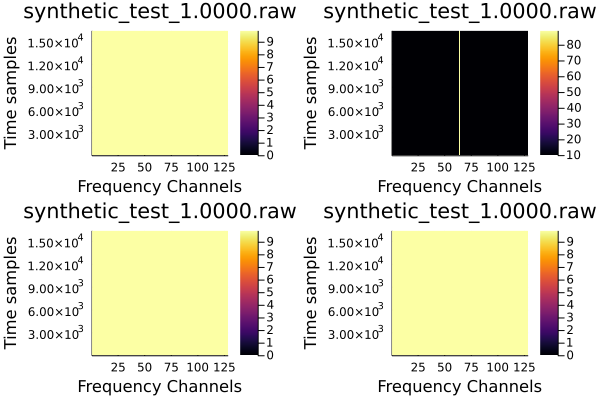

# Fundamental Beamforming Tests

For the purposes of brevity, the RAW data is spoken about programmatically, with dimensions [pol, time, chan, ant].

0. cal_all Ones, delays Zeros, RAW signal in [:, :, NCHAN/2, :]

GUPPI RAW Input

Beamformed Output (No upchannelization)

Beamformed Output (upchannelization rate of 4)

1. cal_all Ones, delays Zeros, RAW signal in [:, :, NCHAN/2, NANT/2]

GUPPI RAW Input

Beamformed Output (No upchannelization)

Beamformed Output (upchannelization rate of 4)

